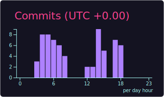

  

  
  
  

---

### 👨‍💻 About Me

I am a Data Science enthusiast currently conducting my **Final Year Dissertation** under the supervision of **TCG CREST**. I am passionate about leveraging Deep Learning and Generative AI to solve real-world problems.

- 🔭 **I’m currently working on:**
  - A **Resume Optimizer** using Gen AI and PyGithub.
  - A **Deep Learning-based Dialect Detection System** for low-resource Bengali dialects of West Bengal and Bangladesh.

- 💬 **Ask me about:** Deep Learning, Machine Learinng, Automation, Optimization.

---

### 🛠 Tech Stack

**Languages**

**Frameworks**

**Libraries**

**Tools & DevOps**

---

### 📊 GitHub Stats

  

  
  
  

   
  

